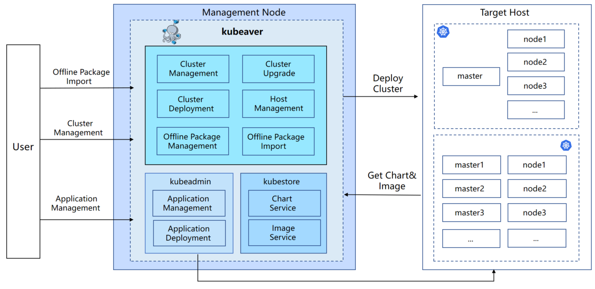
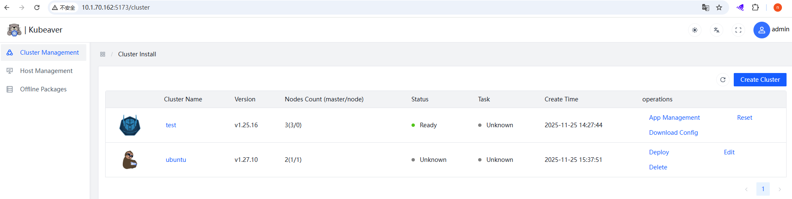
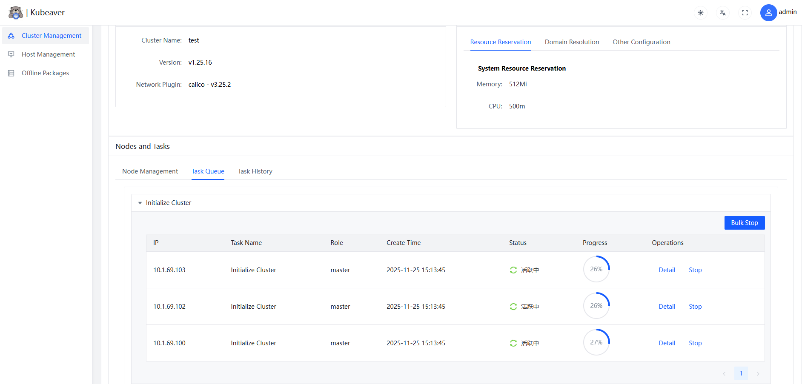
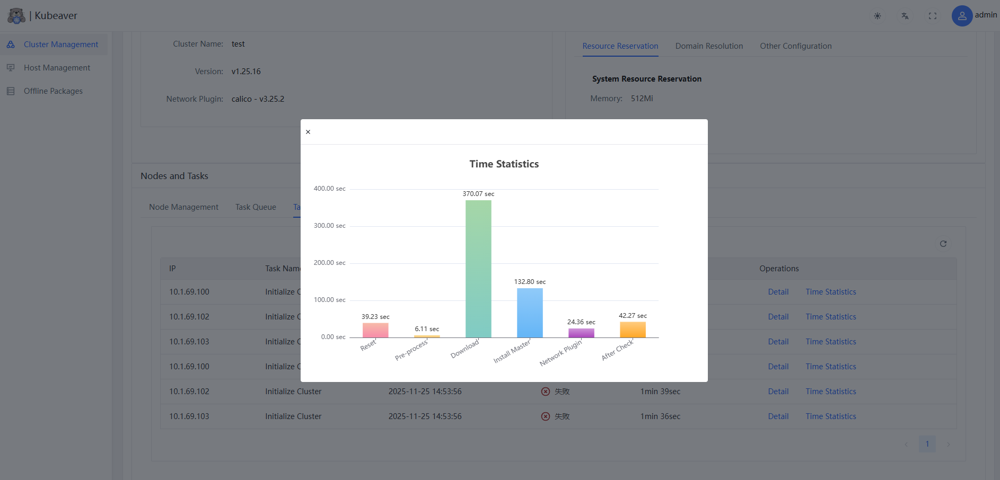
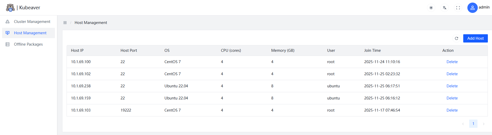
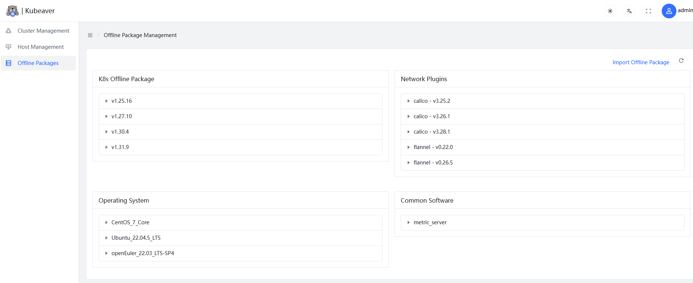

<h1 align="center">

  

   

</h1>

> **NOTICE:** Kubeaver is a [CNCF conformance-certified installer](https://www.cncf.io/training/certification/software-conformance/).

[](https://www.cncf.io/training/certification/software-conformance/).
[](https://github.com/eb-k8s/kubeaver/actions/workflows/build_package.yaml)
[](LICENSE)
[](https://github.com/eb-k8s/kubeaver/releases)


Kubeaver is a tool for quickly deploying high-availability Kubernetes (K8s) clusters, supporting **online(in progress) and offline** methods. The project is based on [kubespray](https://github.com/kubernetes-sigs/kubespray), leveraging Ansible to automate deployment tasks, and provides a user-friendly **graphical user interface**. Refer to the **[documentation](https://eb-k8s.github.io/kubeaver/)** for more details on how to use Kubeaver.

## Features 

* Cluster Management  
* Deploy Cluster (Offline Cluster Deployment) 
* Task Management
* Task Time Statistics
* Task Real-time Output
* Node Management  
* Offline Package Management
* Host Management

## System Architecture

<div align="center">
  
</div>

## Screenshots

<table>
    <tr>
        <td width="33%"></td>
        <td width="33%"></td>
    </tr>
    <tr>
        <td width="33%"></td>
        <td width="33%"></td>
    </tr>
    <tr>
        <td width="33%"></td>
        <td width="33%"></td>
    </tr>
</table>

## Compatibility

The default backend for Kubeaver 1.0.0 is v1.0.0-125, which supports Kubernetes versions 1.25 to 1.27. To extend support to include versions 1.28 through 1.30, you can modify the Docker Compose configuration.

| kubeaver version | backend version | 1.25.x | 1.26.x | 1.27.x | 1.28.x | 1.29.x | 1.30.x |
|------------------|----------------|--------|--------|--------|--------|--------|--------|
| 1.0.0            | v1.0.0-125     |   ✔    |   ✔    |   ✔   |   x    |   x    |   x    |
| 1.0.0            | v1.0.0-128     |   x    |   x    |    x   |   ✔    |   ✔   |   ✔    |

Key:
* ✔: Compatible: The components are tested and guaranteed to work with this Kubernetes version.
* x: Incompatible: The components are not guaranteed to support this Kubernetes version, as it falls outside the tested and supported range.

## Install & Run kubeaver

**System requirements:**

On a Linux host: docker 20.10.10-ce+ and docker-compose 1.18.0+ .

**Download and Unpack the Installer:**

1. Go to the Kubeaver releases page.

2. Download the online or offline installer for the version you want to install.

   Download binaries of **[Kubeaver release ](https://github.com/eb-k8s/kubeaver/releases)** and follow.

3. Use tar to extract the installer package:

```ShellSession
tar xzvf kubeaver-offline-installer-x.x.x.tgz
```
4. Install and start Kubeaver by using the start.sh script:

```ShellSession
./start.sh
```

After this, Kubeaver will be successfully installed on your host. You can now access it via port 80.


### Offline Package Import

Before deploying a Kubernetes cluster, you need to import the base package and extension packages according to your requirements. The base package contains essential components required for K8s cluster deployment, including the basic Flannel network plugin. If you intend to use Calico, you will need to import the Calico extension package. It’s important to note that you must import the corresponding operating system extension package based on the OS of your target cluster nodes.

Below shows how to download the Kubernetes base package for version v1.27.10 and the extension package for CentOS 7 operating system:

```ShellSession
# download base package
cd ./deploy/data/kubeaver/offline   

docker pull ghcr.io/eb-k8s/kubeaver/kubeaver_offline:v1.27.10
docker run -d --name kubeaver_offline ghcr.io/eb-k8s/kubeaver/kubeaver_offline:v1.27.10  
docker cp kubeaver_offline:/root/base_k8s_v1.27.10.tgz .
docker rm -f kubeaver_offline    ##delete container

# download os package
docker pull ghcr.io/eb-k8s/kubeaver/oslib_centos:v1.0
docker run -d --name kubeaver_oslib ghcr.io/eb-k8s/kubeaver/oslib_centos:v1.0 
docker cp kubeaver_oslib:/root/extend_CentOS_7_Core.tgz .
docker rm -f kubeaver_oslib    ##delete container
```
You can then obtain the offline package `base_k8s_v1.27.10.tgz、extend_CentOS_7_Core.tgz` and import it into Kubeaver.

Click here to view more detailed offline package download methods: [Offline package download](./docs/offline_package.md)

### Deploy a K8s Cluster

1. Add the hosts where you want to deploy the K8s cluster in the **Host Management** section.
2. In the **Cluster Management** interface, create your cluster by selecting the cluster version, network plugin, and the hosts included in the cluster.
3. Click **Save**, then select the newly created cluster in the **Cluster Management** interface and click **Deploy** to start the deployment.
4. View the status and progress of tasks in the **Task Queue** or check running/completed tasks in the **Task History**.


## Supported Linux Distributions

- **Ubuntu** 22.04
- **CentOS** 7
- **Rocky Linux** 9
- **openEuler** 22.03

## Supported Components

- Core
  - [kubernetes](https://github.com/kubernetes/kubernetes) 
  - [etcd](https://github.com/etcd-io/etcd) 
  - [containerd](https://containerd.io/) 
- Network Plugin
  - [cni-plugins](https://github.com/containernetworking/plugins) 
  - [calico](https://github.com/projectcalico/calico) 
  - [flannel](https://github.com/flannel-io/flannel) 
- Application
  - [coredns](https://github.com/coredns/coredns) 

## Requirements

- Control Plane
  - Memory: 2 GB
- Worker Node
  - Memory: 1 GB

## License

Kubeaver is released under the terms of the [Apache 2.0](./LICENSE) license.

