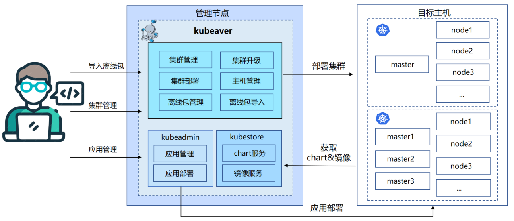

<h1 align="center">

  

   

</h1>

> **注意：** Kubeaver已经通过[CNCF一致性测试认证的installer](https://www.cncf.io/training/certification/software-conformance/)。

[](https://www.cncf.io/training/certification/software-conformance/)
[](https://github.com/eb-k8s/kubeaver/actions/workflows/build_package.yaml)
[](LICENSE)
[](https://github.com/eb-k8s/kubeaver/releases)

Kubeaver 是一个用于快速部署高可用 Kubernetes (K8s) 集群的工具，支持**在线（开发中）和离线**部署方式。项目基于 [kubespray](https://github.com/kubernetes-sigs/kubespray)，利用 Ansible 自动化部署任务，并提供友好的**图形化界面**。更多使用方法请参考 **[文档](https://eb-k8s.github.io/kubeaver/)**。

English [README](../README.md)

## 功能特性

* 集群管理  
* 集群部署（离线集群部署） 
* 任务管理
* 任务耗时统计
* 任务实时输出
* 节点管理  
* 离线包管理
* 主机管理

## 系统架构

<div align="center">
  
</div>

## 截图展示

<table>
    <tr>
        <td width="33%"></td>
        <td width="33%"></td>
    </tr>
    <tr>
        <td width="33%"></td>
        <td width="33%"></td>
    </tr>
    <tr>
        <td width="33%"></td>
        <td width="33%"></td>
    </tr>
</table>

## 兼容性

Kubeaver 1.0.0 默认后端版本为 v1.0.0-125，支持 Kubernetes 1.25 到 1.27 版本。若需支持 1.28 到 1.30，可修改 Docker Compose 配置。

| kubeaver 版本 | 后端版本      | 1.25.x | 1.26.x | 1.27.x | 1.28.x | 1.29.x | 1.30.x |
|--------------|--------------|--------|--------|--------|--------|--------|--------|
| 1.0.0        | v1.0.0-125   |   ✔    |   ✔    |   ✔    |   x    |   x    |   x    |
| 1.0.0        | v1.0.0-128   |   x    |   x    |   x    |   ✔    |   ✔    |   ✔    |

说明：
* ✔：兼容，已通过测试，保证可在该 Kubernetes 版本中正常运行
* x：不兼容，不能保证支持该 Kubernetes 版本，因其不在测试和支持范围内

## 安装与运行 Kubeaver

**系统要求：**

Linux 主机：
- 软件：
  - docker 20.10.10-ce+

- 硬件：
  - CPU: 2 vCPU
  - Memory: 4 GB
  - Disk: 60 GB

**下载安装包：**

1. 访问 Kubeaver 发布页面。
2. 下载所需版本的在线或离线安装包。
   下载二进制文件请访问 **[Kubeaver release ](https://github.com/eb-k8s/kubeaver/releases)** 并按说明操作。
3. 使用 tar 解压安装包：

```shell
tar xzvf kubeaver-offline-installer-1.0.0.tgz
```
4. 切换到安装目录：
~~~shell
cd kubeaver-offline-installer-1.0.0
~~~

5. 运行 start.sh 安装并启动 Kubeaver：

```shell
./start.sh
```

安装完成后，可通过 80 端口访问 Kubeaver。

### 离线包导入

在部署 Kubernetes 集群前，需要根据需求导入基础包和扩展包。基础包包含 K8s 集群部署所需的核心组件及 Flannel 网络插件。如需使用 Calico，请导入 Calico 扩展包。请根据目标集群节点的操作系统导入对应的操作系统扩展包。

以下示例展示如何下载 v1.27.10 版本的 Kubernetes 基础包和 CentOS 7 操作系统扩展包：

```shell
# 下载基础包
cd ./deploy/data/kubeaver/offline   

docker pull ghcr.io/eb-k8s/kubeaver/kubeaver_offline:v1.27.10
docker run -d --name kubeaver_offline ghcr.io/eb-k8s/kubeaver/kubeaver_offline:v1.27.10  
docker cp kubeaver_offline:/root/base_k8s_v1.27.10.tgz .
docker rm -f kubeaver_offline    ##删除容器

# 下载操作系统包
docker pull ghcr.io/eb-k8s/kubeaver/oslib_centos:v1.0
docker run -d --name kubeaver_oslib ghcr.io/eb-k8s/kubeaver/oslib_centos:v1.0 
docker cp kubeaver_oslib:/root/extend_CentOS_7_Core.tgz .
docker rm -f kubeaver_oslib    ##删除容器
```
获得离线包 `base_k8s_v1.27.10.tgz、extend_CentOS_7_Core.tgz` 后，导入至 Kubeaver。

点击查看更详细的离线包下载方法：[离线包下载](../docs/offline_package.md)

### 部署 K8s 集群

1. 在**主机管理**中添加待部署 K8s 集群的主机。
2. 在**集群管理**界面，选择集群版本、网络插件及包含的主机，创建集群。
3. 点击**保存**，然后在**集群管理**界面选择新建集群并点击**部署**开始安装。
4. 可在**任务队列**查看任务状态和进度，或在**任务历史**查看运行/完成的任务。

#### K8s节点要求

- 控制节点
  - Memory: 2 GB
- 工作节点
  - Memory: 2 GB
- 操作系统
  - **Ubuntu** 22.04
  - **CentOS** 7
  - **Rocky Linux** 9
  - **openEuler** 22.03

## 支持的组件

- 核心组件
  - [kubernetes](https://github.com/kubernetes/kubernetes) 
  - [etcd](https://github.com/etcd-io/etcd) 
  - [containerd](https://containerd.io/) 
- 网络插件
  - [cni-plugins](https://github.com/containernetworking/plugins) 
  - [calico](https://github.com/projectcalico/calico) 
  - [flannel](https://github.com/flannel-io/flannel) 
- 应用组件
  - [coredns](https://github.com/coredns/coredns) 

## 许可证

Kubeaver 以 [Apache 2.0](../LICENSE) 协议发布。