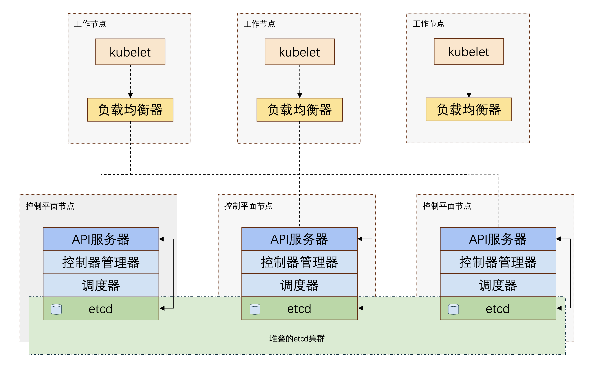
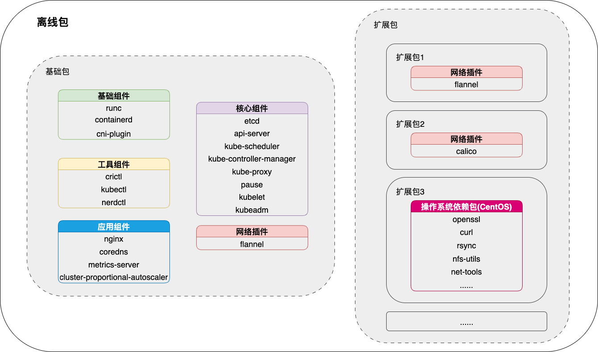

# Kubeaver

Kubeaver是快速部署高可用Kubernetes (K8s) 集群的工具，支持**在线和离线**两种方式，项目基于[kubespray](https://github.com/kubernetes-sigs/kubespray)，使用Ansible实现部署任务的自动化，并且提供了用户友好的**图形化界面**。

Kubeaver具有以下优点：

* **任务并发**：部署集群所需时间不随集群规模增加而显著增加。

* **离线部署**：能够在完全离线的情况下部署K8s集群，完全屏蔽网络的影响，根据自己的需求下载离线包导入Kubeaver，实现快速一键部署。

* **基本集群管理功能**：使用Kubeaver进行集群的部署、升级、扩缩容、重置操作。

* **自定义集群配置**：你可以选择自定义集群的组件，如网络插件、应用，同时可以配置集群的高级参数。

* **实时任务进度追踪**：任务进度实时查看，任务阶段时间统计。

⚠️ 注意：如果您能够访问互联网，但是因为网络问题无法下载K8s集群相关的镜像和文件而无法使用在线模式部署K8s集群，我们十分推荐您使用离线模式来快速部署K8s集群。

下图展示了使用Kubeaver部署的K8s集群整体架构：



🚧 该项目目前处于开发阶段（进行中），如果您对我们的项目有什么想法或建议，请提issue，我们都会尽快回复。

[English](../README.md)


## 快速开始

### 安装Docker和Docker Compose

在您需要安装Kubeaver的主机上安装Docker，请使用Docker的官方指引安装Docker：[Install Docker Engine](https://docs.docker.com/engine/install/)，安装完成后运行`docker compose version`命令，确保Docker Compose已正确安装，如果没有，请额外手动安装Docker Compose。

### 部署Kubeaver

使用Docker拉取Kubeaver的相关镜像：
```
# 拉取前端镜像
docker pull ghcr.io/eb-k8s/kubeaver/kubeaver_frontend:v1.0.0
# 拉取后台镜像
docker pull ghcr.io/eb-k8s/kubeaver/kubeaver_backend:v1.0.0-125
```
使用Docker Compose启动Kubeaver:
```
# 切换到Docker Compose文件所在目录
cd ./deploy
# 启动Kubeaver
docker compose up -d
```
至此，Kubeaver已经成功安装在您的主机上，您此时可以访问 http://127.0.0.1:80 打开Kubeaver。

### 离线包导入

如果您需要在离线环境下部署K8s集群，或者因为网络问题无法下载K8s集群相关的文件和镜像，您可以根据要安装的K8s集群版本，下载对应版本的离线包，然后导入Kubeaver，并在部署集群时选择离线模式，即可离线部署K8s集群。

离线包所包含的内容如下图所示：


### 部署K8s集群

1. 在主机管理部分添加您想要部署 K8s 集群的主机。
2. 在集群管理界面中，通过选择集群版本、网络插件以及集群中包含的主机来创建您的集群。
3. 点击保存，然后在集群管理界面中选择新创建的集群并点击部署以开始部署。
4. 在任务队列中查看任务的状态和进度，或在任务历史中检查正在运行或已完成的任务。

### 功能介绍

*  添加主机
*  创建集群
*  部署集群
*  集群管理
*  节点管理
*  离线包管理

## 支持的操作系统

- **Ubuntu** 22.04
- **CentOS** 7
- **Rocky Linux** 9
- **openEuler** 22.03

## 支持的组件

- Core
  - [kubernetes](https://github.com/kubernetes/kubernetes) 
  - [etcd](https://github.com/etcd-io/etcd) 
  - [containerd](https://containerd.io/) 
- Network Plugin
  - [cni-plugins](https://github.com/containernetworking/plugins) 
  - [calico](https://github.com/projectcalico/calico) 
  - [flannel](https://github.com/flannel-io/flannel) 
- Application
  - [coredns](https://github.com/coredns/coredns) 

## 硬件需求

- 控制平面
  - 内存: 2 GB
- 工作节点
  - 内存: 1 GB

## 相关文档

* [How it works](./how_it_works_CN.md)

[](LICENSE)